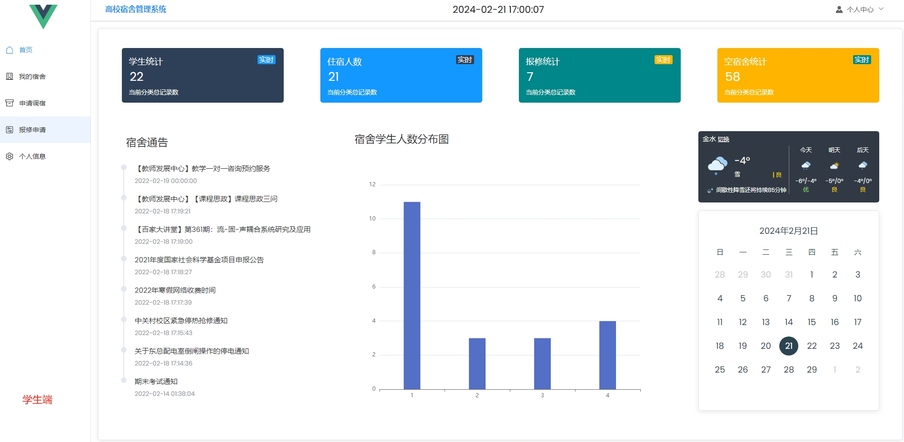
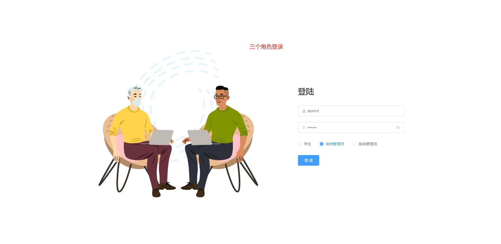
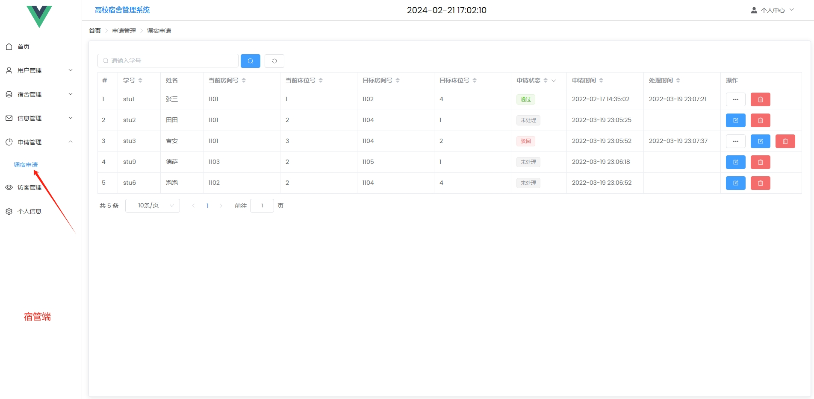
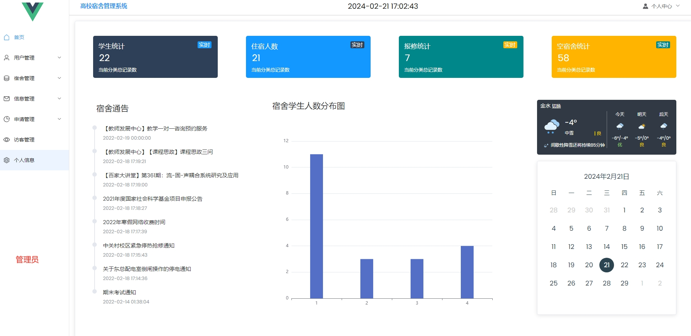
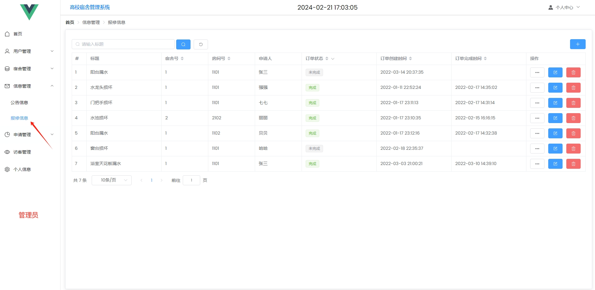

 **郑重声明：项目经过本地测试，确保可以运行， 可以用于学习和毕业设计参考~** 

[点我获取源码](https://x-x.fun/e/CU79de7d2eNeJ)💕

[点我查看更多](http://blog.cyrobot.top/blog)🤞

#### 1.项目介绍
- 宿舍管理系统，是前后端分离项目。功能包括：权限管理，菜单管理，项目运行宿舍管理，学生管理，班级管理，宿舍楼管理，各项记录（归寝记录，维修记录，请假记录，晚归记录。
- 环境配置：Jdk1.8 + IDEA + Mysql 5.7 
- 技术选型： Springboot + Maven + Mybatis + Vue +Node12.16.1
- 系统角色： 学生、宿管、管理员

#### 2.本地搭建
- 创建数据库，导入dormitory.sql文件
- 准备IDEA环境，导入demo源码，根据本地环境，修改项目src/main/resources/application.properties文件中的数据库名字和数据库账号密码
- 运行SpringbootApplication，启动后端项目
- cd vue
- 执行 npm install
- 执行npm run serve，启动前端项目（报错的话，检查下node的版本，建议低于v18）
#### 3.项目部分截图
